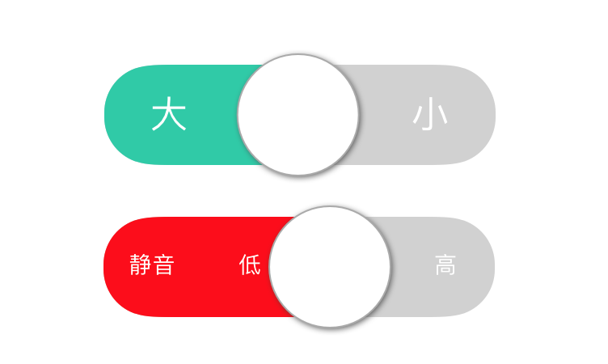
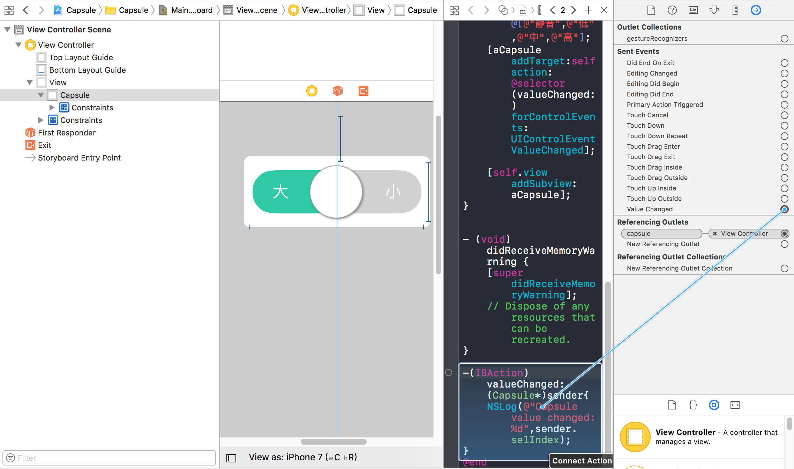

# 一个胶囊式滑块控件

支持超过 2 个以上的选项选择，用户可以通过点击/滑动来设置自己的选择。如图：




## 用法

### 导入源文件

将 Capsule.m/.h 添加到你的项目。在代码中使用 Capsule 时导入对应头文件。

### 通过 IB 创建

拖一个 UIView 到故事板中，设置 Class 为 Capsule。选中 UIView，打开连接面板，从   Value Changed 事件拖一个 IBAction 连接到 View Controller 中。



在 IBAction 方法中编写你的事件处理代码。

### 以源文件方式创建

在 viewDidLoad 方法中调用 initWithFrame 初始化方法：

```
Capsule * aCapsule = [[Capsule alloc]initWithFrame:CGRectMake(62, 180, 250, 86)];
    aCapsule.thumbRadius = 37.5;
    aCapsule.capsuleHeight = 62;
    aCapsule.fillColor = [UIColor redColor];
    aCapsule.titles = @[@"静音",@"低",@"中",@"高"];
    [aCapsule addTarget:self action:@selector(valueChanged:) forControlEvents:UIControlEventValueChanged];
    
    [self.view addSubview: aCapsule];
```

###支持的属性

Capsule 支持以下属性定义：

* UIColor* bgColor ：胶囊的背景色。
* UIColor* fillColor：胶囊的填充色，用于高亮显示当前选中的选项。
* UIColor* textColor：文字颜色。
* UIColor* thumbColor：滑块颜色。
* CGFloat thumbRadius：滑块半径。
* CGFloat thumbShadowWidth：滑块阴影宽度。
* UIColor* thumbBorderColor：滑块边线颜色。
* CGFloat fontSize：文字大小。
* CGFloat capsuleHeight：胶囊体的高度（粗度）。
* int selIndex：当前选中选项的索引。
* CGFloat baseOffset：文字基线偏移，如果你发现文字没有垂直居中，可以用这个值调整几个像素试试，正值往上偏移，负值往下偏移。
* NSArray<NSString*>* titles：用户能够看到的文字选项。

除 titles 属性外，所有属性都可以在 IB 的属性面板中设备，并设有默认值。
